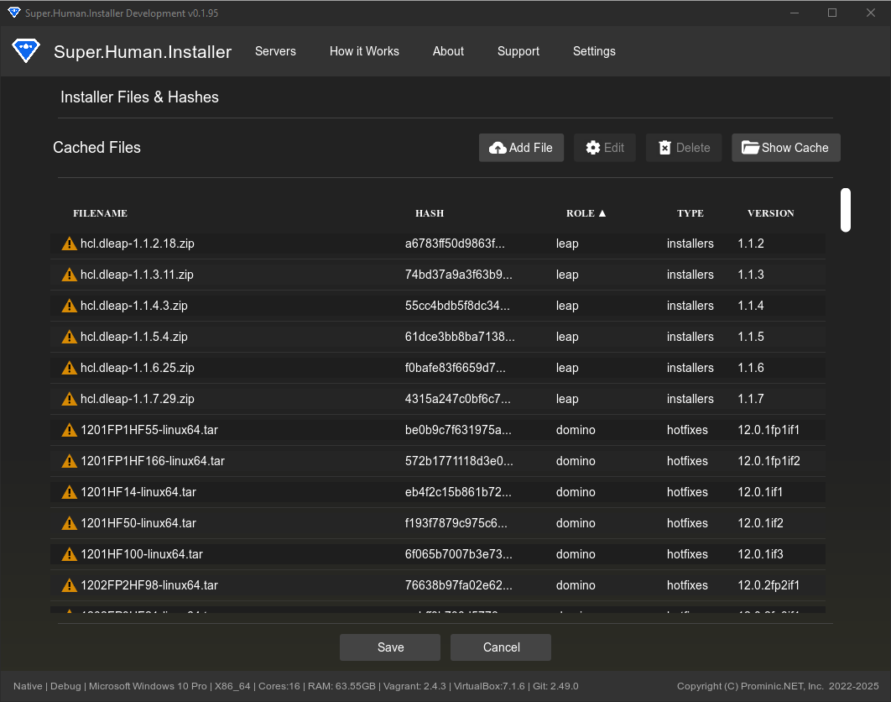

# File Cache & Hashes Manager

The File Cache & Hashes Manager (`HashManagerPage.hx`) provides an interface for managing the local cache of installation files required by provisioners. It allows you to view, add, edit, and verify these files.

Access this page via **Settings -> Manage Installer Files**.

## Overview

Provisioners often require specific installer files (e.g., `.tar`, `.zip` files for Domino, Traveler, Verse) to perform software installation within the VMs. SHI maintains a local cache of these files to avoid repeated downloads and to verify their integrity. This manager helps organize these files and ensures the correct ones are used during provisioning.

## Features

### File Listing and Management

The manager displays all known installation files defined in the application's internal hash registry (`SuperHumanHashes.hx`) or added manually. The table shows:

*   **Filename**: The expected or actual filename of the cached installation file.
*   **Hash (SHA256)**: The expected cryptographic hash used to verify file integrity.
*   **Role**: The software component the file belongs to (e.g., `domino`, `traveler`, `verse`, `nomadweb`, `leap`, `domino-rest-api`).
*   **Type**: The type of file (`installer`, `hotfix`, `fixpack`).
*   **Version**: The expected version of the installation file.
*   **Status**:
    *   **Green Checkmark**: File exists in the cache directory and its SHA256 hash matches the expected hash.
    *   **Yellow Warning Icon**: File is missing from the cache directory.

### Adding/Locating Files

If a file is missing or incorrect (Warning/Error status):

1.  Click the **Locate File** button next to the entry.
2.  A file browser dialog will appear.
3.  Navigate to and select the correct installation file on your local system.
4.  SHI will:
    *   Copy the selected file into the cache directory.
    *   Calculate its SHA256 hash.
    *   Compare the calculated hash with the expected hash.
    *   Update the status icon accordingly.

### Downloading Installers from HCL

You can download source files from HCL by clicking the Yellow warning icon to the left of the installer name. This will prompt you to select the appropriate HCL Download Refresh token.

The refresh token is exchanged for a access token which is then cycled on each download.

### Editing Metadata

You can edit entries in the GUI, not that SHI, upon a fresh install, will copy its known list of entries from the initial-registry.json file. After it has initially loaded them, the persistant cached upon subsequent app restarts is stored in cache-registry.json.

## Cache Directory

*   **Show Cache Directory**: Clicking this button opens the system's file explorer to the location where SHI stores the cached installer files (`<AppStorage>/file-cache/`).
*   **Clear Cache**: This button removes *all* files from the cache directory. You will need to re-locate or re-download necessary files afterwards.

## File Verification

SHI relies on SHA256 hashes to ensure the integrity and correctness of installer files. When a provisioner needs a file, SHI checks the cache:

1.  Does the file exist?
2.  Does the file's SHA256 hash match the expected hash stored in the registry?

If both conditions are met, the file is used for provisioning. If the file is missing or the hash mismatches, provisioning for that role may fail.

## Relevant Files

*   [Source/superhuman/components/HashManagerPage.hx](https://github.com/Moonshine-IDE/Super.Human.Installer/blob/master/Source/superhuman/components/HashManagerPage.hx) - UI implementation for this page.
*   [Source/superhuman/server/cache/SuperHumanFileCache.hx](https://github.com/Moonshine-IDE/Super.Human.Installer/blob/master/Source/superhuman/server/cache/SuperHumanFileCache.hx) - Core cache management logic (locating files, verifying hashes).
*   [Source/superhuman/server/cache/SuperHumanCachedFile.hx](https://github.com/Moonshine-IDE/Super.Human.Installer/blob/master/Source/superhuman/server/cache/SuperHumanCachedFile.hx) - Data structure for cached file information.
*   [Source/superhuman/config/SuperHumanHashes.hx](https://github.com/Moonshine-IDE/Super.Human.Installer/blob/master/Source/superhuman/config/SuperHumanHashes.hx) - Internal registry of known files, hashes, roles, types, and versions.
