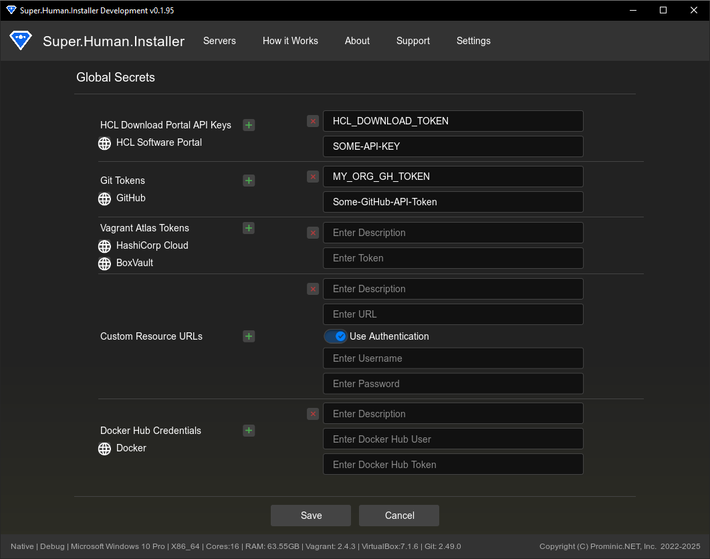

# Secrets Management

The Secrets page provides an interface for managing sensitive credentials used by Super.Human.Installer (SHI), primarily for accessing private Git repositories.

## Overview

Sensitive information like API keys should not be hardcoded. The Secrets page allows you to securely store and manage credentials needed for specific SHI features, such as importing provisioners from private GitHub repositories.

Access this page via **Settings -> Manage Global Secrets**.

## Git API Keys / Personal Access Tokens (PATs)

Git API keys (often called Personal Access Tokens or PATs on platforms like GitHub, GitLab, Bitbucket) allow SHI to authenticate with private Git repositories when using the "Import from GitHub" feature on the [Provisioner Import](provisioner-import) page.

### Managing Git API Keys

*   **Adding a Key**:
    1.  Click "Add".
    2.  Enter a descriptive **Name** for the token (e.g., "My GitHub PAT").
    3.  Paste the actual **API Key / Token** value obtained from your Git provider (e.g., GitHub Developer Settings).
    4.  Click "Save" in the row.
*   **Editing a Key**:
    1.  Click "Edit" next to an existing key.
    2.  Modify the Name or Key value.
    3.  Click "Save" in the row.
*   **Deleting a Key**:
    1.  Click "Delete" next to the key you want to remove.

Changes are saved only when you click the main "Save" button at the bottom of the Secrets page.

### Usage

When using the "Import from GitHub" feature on the [Provisioner Import](provisioner-import) page, the "GitHub Token" dropdown will be populated with the names of the keys you've saved here. Selecting a token allows SHI to clone private repositories associated with that token. Choose "None" for public repositories.

## SSH Keys

You can Add SSH keys and reference them in a Hosts.template.yml by using the SSH Keys description in between the :: delimeters.

## Security Considerations

*   Secrets are stored within the main SHI configuration file (`.shi-config`) in your user's application storage directory. Ensure this file is adequately protected according to your system's security practices.
*   Use tokens/keys with the minimum required permissions (e.g., read-only access to specific repositories).
*   Use tokens with expiration dates where possible.
*   Regularly review and rotate your keys/tokens according to security best practices.

## Relevant Files

*   [Source/superhuman/components/SecretsPage.hx](https://github.com/Moonshine-IDE/Super.Human.Installer/blob/master/Source/superhuman/components/SecretsPage.hx) - UI implementation for this page.
*   [Source/superhuman/config/SuperHumanSecrets.hx](https://github.com/Moonshine-IDE/Super.Human.Installer/blob/master/Source/superhuman/config/SuperHumanSecrets.hx) - Data structure definition for secrets.
*   [Source/superhuman/config/SuperHumanConfig.hx](https://github.com/Moonshine-IDE/Super.Human.Installer/blob/master/Source/superhuman/config/SuperHumanConfig.hx) - Main configuration where secrets are stored.
*   [Source/superhuman/managers/ProvisionerManager.hx](https://github.com/Moonshine-IDE/Super.Human.Installer/blob/master/Source/superhuman/managers/ProvisionerManager.hx) - Uses saved Git tokens during GitHub imports.
