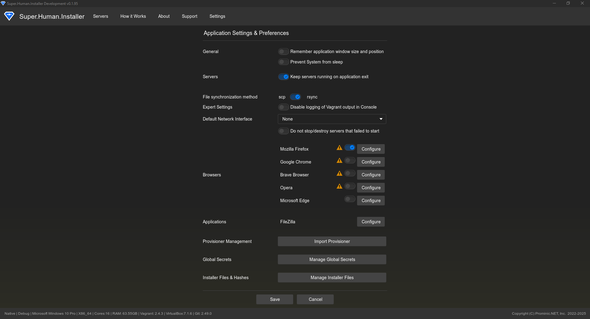

  

    Table of contents
  

  {: .text-delta }
1. TOC
{:toc}

# Settings & Management

The Settings page in Super.Human.Installer (SHI) provides access to application-wide configuration options and specialized management interfaces.

## Overview

The Settings page serves as a central hub for configuring SHI's behavior and accessing tools for managing various aspects of the system, such as secrets, cached files, and provisioners.

## Main Settings

The main Settings page includes options for configuring:

### General Application Behavior

*   **Save window position**: Remembers the application window position and size between launches.
*   **Prevent system from sleep**: Attempts to prevent the host operating system from entering sleep mode while servers are running.
*   **Keep servers running on exit**: If unchecked, SHI will attempt to stop all running servers when the application is closed. If checked, servers will continue running in the background.
*   **Keep failed servers running**: If checked, servers that encounter an error during provisioning will remain running for inspection. If unchecked, they will attempt to halt.
*   **Disable Vagrant logging**: Reduces the amount of output shown in the server Console by suppressing detailed Vagrant logs. Useful for cleaner output, but may hide important debugging information.

### File Synchronization

*   **Sync method**: Choose the preferred method for synchronizing files between the host and guest VMs (used by Vagrant synced folders).
    *   **Rsync**: Generally faster, especially for large changes. Requires `rsync` to be installed and accessible on the host system. Default on macOS/Linux.
    *   **SCP**: Uses Secure Copy Protocol over SSH. More broadly compatible, especially on Windows without extra setup, but can be slower.
    *   *Note: Compatibility issues with older Rsync versions on macOS might automatically force SCP.*

### Default Network Interface

*   **Default Network Interface**: Select a default host network interface to use for bridged networking in new server configurations. Can be overridden in Advanced Configuration per server. Select "None" to not have a default.

### Browser and Application Management

*   **Browsers List**: Configure external web browsers used by SHI (e.g., when clicking the "Web" button for a server). Set a default browser.
*   **Applications List**: Configure paths to external applications used by SHI features (e.g., FileZilla for the "FTP" button).

## Relevant Files

*   [Source/superhuman/components/SettingsPage.hx](https://github.com/Moonshine-IDE/Super.Human.Installer/blob/master/Source/superhuman/components/SettingsPage.hx) - Main Settings page UI implementation.
*   [Source/superhuman/config/SuperHumanPreferences.hx](https://github.com/Moonshine-IDE/Super.Human.Installer/blob/master/Source/superhuman/config/SuperHumanPreferences.hx) - Data structure for preferences.
*   [Source/superhuman/config/SuperHumanConfig.hx](https://github.com/Moonshine-IDE/Super.Human.Installer/blob/master/Source/superhuman/config/SuperHumanConfig.hx) - Main configuration structure where preferences are stored.
*   [Source/superhuman/components/filesync/FileSyncSetting.hx](https://github.com/Moonshine-IDE/Super.Human.Installer/blob/master/Source/superhuman/components/filesync/FileSyncSetting.hx) - UI component for sync method selection.
*   [Source/superhuman/browser/Browsers.hx](https://github.com/Moonshine-IDE/Super.Human.Installer/blob/master/Source/superhuman/browser/Browsers.hx) & [Source/superhuman/components/browsers/BrowsersList.hx](https://github.com/Moonshine-IDE/Super.Human.Installer/blob/master/Source/superhuman/components/browsers/BrowsersList.hx) - Browser configuration logic and UI.
*   [Source/superhuman/application/Applications.hx](https://github.com/Moonshine-IDE/Super.Human.Installer/blob/master/Source/superhuman/application/Applications.hx) & [Source/superhuman/components/applications/ApplicationsList.hx](https://github.com/Moonshine-IDE/Super.Human.Installer/blob/master/Source/superhuman/components/applications/ApplicationsList.hx) - External application logic and UI.
